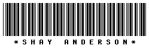
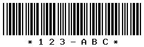

# PHP Barcode Generator Class Code 39

Here is an easy to use PHP barcode generator class for code 39 barcodes. 

[PHP Barcode Generator Class Code 39](http://www.shayanderson.com/php/php-barcode-generator-class-code-39.htm)

Installation
============

This package can be installed easily using [Composer](http://getcomposer.org).
Simply add the following to the ``composer.json`` file at the root of your project:

    {
      "require": {
        "fobiaweb/barcode39": "*"
      }
    }

Then install your dependencies using ``composer.phar install``.

Requirements: 
=============

PHP Web server and [GD Library](http://php.net/manual/en/book.image.php) (Graphics Library). 

Documentation
=============

The PHP class will create a GIF barcode image or save a GIF barcode image file, here is an example:

    // include Barcode39 class 
    include "Barcode39.php"; 
    
    // set Barcode39 object 
    $bc = new Barcode39("Shay Anderson"); 
    
    // display new barcode 
    $bc->draw();

This example will output this barcode: 

You can also easily adjust the barcode bar sizes and text size:

    // set object 
    $bc = new Barcode39("123-ABC"); 
    
    // set text size 
    $bc->barcode_text_size = 5; 
    
    // set barcode bar thickness (thick bars) 
    $bc->barcode_bar_thick = 4; 
    
    // set barcode bar thickness (thin bars) 
    $bc->barcode_bar_thin = 2; 
    
    // save barcode GIF file 
    $bc->draw("barcode.gif");

This example will save this barcode as "barcode.gif": 

